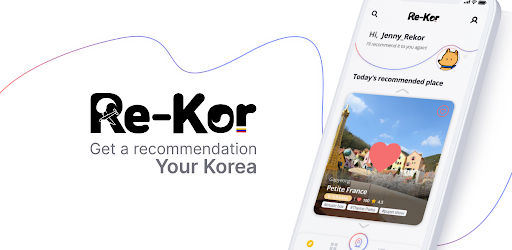

# Re-Kor  
###Get a recommendation Your Korea  

___

##프로젝트 소개
|   |    | 
|---|:---:|
| `이름` |Re-Kor | 
| `주요 타겟` | 한국 여행을 원하는 외국인 | 
| `서비스 형태` | 모바일 어플리케이션 |  
| `지원 언어` | 한국어, 영어, ~~중국어~~ |  
| `대표 기능` | - 유저의 취향을 반영한 관광 코스 추천시스템  | 
| | - 한국을 대표하는 카테고리별로 관광정보 제공  | 
| | - 관광(지역)에 대한 양방향 번역 사전 제공  | 
| | - 다양한 외국인을 수용하기 위한 다중 언어 지원  | 
| | - 관광지에 대한 리뷰 작성/공유  | 
___
##서비스 링크
Android : [Google Play Store](https://play.google.com/store/apps/details?id=com.suji_chae.ReKor)  
IPhone : 출시 예정

___
##Front-Side Repository
GitHub : [Re-kor App](https://github.com/ChaeHyun-Kim/Re-Kor)

___
##기술 스택  
 - BackEnd : Java 14, SpringBoot
 - Database : MariaDB, MongoDB
 - Infra : Jenkins, Docker, Harbor, Nginx
 - Communication : REST API
___
##시스템 구조

